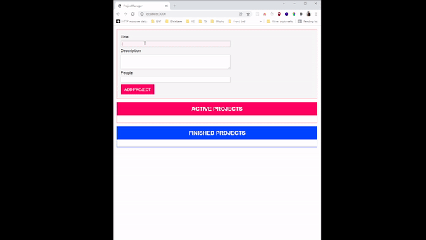

# Projects Drag and Drop

## Contents

- [Description](#description)
- [Features](#features)
- [Requirements](#requirements)
- [Installation](#installation)
- [Screenshots](#screenshots)

## Description

In this project I learn how to implemented my learning progress of typescript. I make a drag and drop project with typescript in class

## Preview

<div style="text-align:center">

</div>

## Features

- Add project
- Drag and Drop
- Move project from active into finished and vice versa
- typescript
- OOP (Object-Oriented Programming)

## Installation

1. Open your terminal or command prompt
2. Clone the project

```bash
$ git clone https://github.com/sipamungkas/drag-n-drop-html-typescript
```

3. Move inside the directory and install and link dependency

```bash
$ cd drag-n-drop-html-typescript
$ yarn install
```

4. Compile or build project

```bash
$ npm i -g typescript
$ tsc
```

5. Run the project

- open index.html
- open from terminal

```bash
$ yarn start
```
